# Minicraft+ POEditor Stats

This repository is used for showing the POEditor stats as a stats card in markdown from the POEditor for Minicraft+ to use.

Sample SVG for Minicraft+ project in POEditor:


> ```diff
> # Referenced source: https://github.com/anuraghazra/github-readme-stats
> ```
